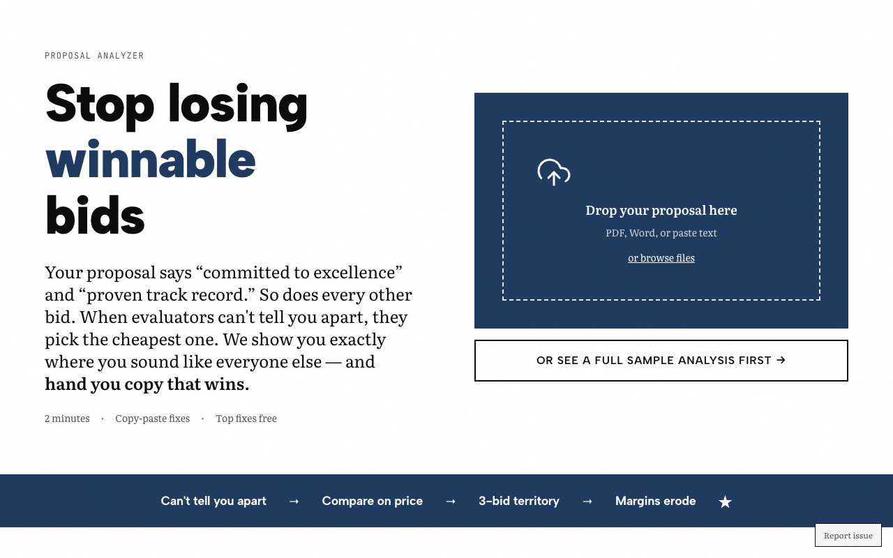

# The Proposal Analyzer

**Stop writing proposals that sound like everyone else's.**

Upload your proposal before submitting. Get a Commodity Score plus specific fixes to stand out from competitors who all say the same things. Results in 3 minutes.

🔗 **Live app:** [proposal-analyzer.vercel.app](https://proposal-analyzer.vercel.app)

---

## What it does

1. **Upload your proposal** - PDF, DOCX, or paste text
2. **Get a Commodity Score** - How generic does your proposal sound?
3. **See specific fixes** - Before/after suggestions to differentiate
4. **Download improved version** - PDF ready to submit

## Screenshot



## Tech stack

- **Next.js 15** (App Router)
- **Claude API** for intelligent analysis
- **Stripe** for payments ($97/analysis)
- **Vercel KV** for result storage
- **Vercel Blob** for file uploads

## Features

- 📄 Supports PDF, DOCX, and plain text
- 🎯 Commodity phrase detection (200+ patterns)
- 💡 Specific rewrite suggestions
- 📥 Downloadable PDF results
- 🔗 Shareable result links

## Local development

```bash
git clone https://github.com/lee-fuhr/proposal-analyzer.git
cd proposal-analyzer
npm install
cp .env.example .env.local
# Add your API keys
npm run dev
```

## Environment variables

```
ANTHROPIC_API_KEY=     # Required - Claude API
STRIPE_SECRET_KEY=     # Required - payments
KV_REST_API_URL=       # Vercel KV
KV_REST_API_TOKEN=     # Vercel KV
BLOB_READ_WRITE_TOKEN= # Vercel Blob
```

## Related tools

- [The Commodity Test](https://commodity-test.vercel.app) - Analyze website messaging
- [Risk Translator](https://risk-translator.vercel.app) - Translate specs into risk language

---

Built by [Lee Fuhr](https://leefuhr.com) • Messaging strategy for companies that make things
